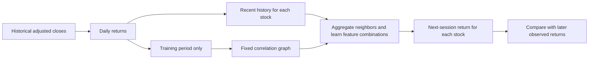

# Build and evaluate a simple GNN for stock returns

**Monthly update:** The default is now **21 trading sessions** (`--horizon 21`),
approximately one month. Read [MONTHLY_MODEL.md](MONTHLY_MODEL.md) for the trained
monthly model's inputs, results, limitations, and possible improvements. The
data-to-model pipeline below is shared across horizons. The model retains daily
features, retrains on 21-session targets, and uses a 21-origin gap at split
boundaries. New checkpoints list all feature names explicitly.

**Previous weekly experiment:** A five-session version is available with
`--horizon 5`. The original daily walkthrough below is
retained as a worked example. Use `--horizon 1` to run that version. See
[the weekly results](runs/weekly/REPORT.md) and
[daily-versus-weekly comparison](runs/horizon_comparison/REPORT.md).

For weekly prediction, the label changes from tomorrow's return to:

```text
weekly_target[i,t] = 100 × (P[i,t+5] / P[i,t] - 1)
```

This is the compounded total return, not the sum or average of five daily
returns. For example, five successive +10% returns produce +61.051%, not +50%.
The inputs remain the previous 20 **daily** returns plus the same three summary
features; the architecture and optimizer settings are unchanged.

The model is retrained for this target. Five forecast origins are excluded
between each pair of split blocks so every earlier label is available before
the next block begins. Validation and test start dates stay at the original
calendar boundaries. Training graph/scaler estimates use only the resulting
eligible training history. Each checkpoint and new prediction CSV records
`horizon_sessions`, and new price columns use `target_adjusted_close` naming
instead of implying the target is tomorrow.

We issue five-session forecasts each day, so their outcomes overlap. The report
also evaluates every fifth forecast origin to remove overlapping return
intervals. The comparison matches the daily and weekly forecast dates and
reports improvement over each horizon's own zero-return baseline. The weekly
run slightly beats zero but loses to historical average weekly returns. Since
this follow-up was motivated by inspecting the original test results, it is
exploratory evidence, not a fresh untouched test of a chosen strategy.

The original daily-specific numbers and one-session descriptions below refer
to the preserved `runs/historical` experiment; the weekly reports contain the
updated numbers and split counts.

This tutorial assumes you know basic Python and arrays. You do not need previous
experience with graph neural networks. The objective is to understand every part
of a small experiment: what it predicts, what information it may use, how a graph
changes a neural network, how the parameters learn, and what the results mean.

The completed real-data run is in [the historical report](runs/historical/REPORT.md).
Read this document with [stock_gnn.py](stock_gnn.py) open beside it. The numbered
code sections correspond to the stages explained below.

## 1. Define a question a model can answer

“Model the stock market” is too broad for a first supervised-learning experiment.
We will ask this precise question:

> After observing the close of session t for 12 stocks, can we predict each
> stock's percentage return from that close to the following session's close?

For stock i, define its adjusted close as P[i,t] and its daily return as:

```text
r[i,t] = 100 × (P[i,t] / P[i,t-1] - 1)
target y[i,t] = r[i,t+1]
```

If a price increases from 100 to 101.50, the return is 1.50. All returns in the
program use **percentage points**, so 1.50 means +1.50%, not +150%.
An error between a +1.50% forecast and a +0.50% outcome is 1 percentage point.

This is regression: the output is a real number, rather than an up/down label.
There is one output per stock per forecast date. Forecasts use the latest known
history at each date, while the fitted model stays fixed throughout the test.
This is a series of one-session forecasts, not a recursive forecast of the
entire future price path.

Why predict returns? Stocks have different price scales, and changes are the
quantity we want to forecast. A model that predicts “tomorrow's price is today's
price” can look excellent on a price chart while predicting no movement at all.
We therefore evaluate return errors directly and include exactly that
zero-return baseline.

An after-close forecast cannot assume a fill at the close it just observed.
This tutorial evaluates predictive accuracy. Turning it into a trading test
requires a different, executable timing convention, such as a next-open entry,
along with the corresponding data and target.

## 2. Understand the graph

In a normal spreadsheet model, each stock might be treated independently.
A GNN lets related stocks exchange information.

| Graph concept | Meaning in this example |
| --- | --- |
| Node | One stock, such as AAPL or JPM |
| Node features | That stock's recent returns and simple summaries |
| Edge | A positive return correlation estimated from training history |
| Edge weight | Strength of the retained positive correlation |
| Message passing | Combine neighboring stocks' feature vectors |
| Node prediction | That stock's next-session return |

Suppose three technology stocks move together. Their individual returns might
contain a shared sector movement plus company-specific noise. Aggregating their
features could help expose that common movement. That is a hypothesis, not a
guarantee: the shared movement may have no predictive value for tomorrow, and
averaging may remove useful differences between firms.

The graph does not encode causation. A correlation edge does not establish that
one company causes another to move or that either leads the other in time.



This is a small dense graph implementation using ordinary PyTorch. You can see
the aggregation as matrix multiplication without needing a graph-specific
library. For a large universe, sparse graph operations would be more efficient.

## 3. Acquire and inspect real historical prices

`download_prices.py` requests daily histories for these illustrative stocks:

```text
AAPL MSFT GOOGL NVDA
JPM BAC GS MS
XOM CVX COP SLB
```

They provide three rough industry groups. They are examples, not stock picks.
The selected universe includes currently surviving firms, so this is not a
historically representative sample of all companies that could have been chosen.

The downloader calls `yf.download` with `auto_adjust=True`, takes the resulting
`Close` field, and saves one column per stock. The requested end date is
exclusive. These options follow the [yfinance API documentation](https://ranaroussi.github.io/yfinance/reference/api/yfinance.download.html).
See also the project's [data-use notes](https://github.com/ranaroussi/yfinance).

The adjusted-close series reflects the provider's handling of corporate
actions. It is useful for studying returns, but it is not necessarily the dollar
price that appeared on an exchange screen that day. Historical revisions and
adjustments mean this is not an archived, point-in-time market-data feed.

The input is a wide CSV:

```csv
Date,AAPL,MSFT,JPM
2020-01-02,example_price,example_price,example_price
2020-01-03,example_price,example_price,example_price
```

Those placeholder words only illustrate the shape. Use actual positive numbers.
`load_prices` requires valid, sorted, unique dates and finite positive prices.
The downloader stops on missing prices instead of filling them or deleting
dates. Filling a missing quote can invent a zero return; deleting a date can
turn a “one-day” return into a multi-session return.

For custom CSVs, you are responsible for the session calendar, adjustment
convention, currencies, and synchronized availability of all stock closes.
The loader cannot identify a completely absent trading session from the CSV
alone. The example uses US stocks on a shared daily calendar; mixing exchanges
with different closing times needs a stricter timestamp treatment.

Run the commands in [README.md](README.md). Internet access is needed for the
download and installation, but subsequent runs reuse the local price snapshot.

## 4. Convert prices into supervised examples

Read `window_features` and `make_samples`.

For every forecast date t, collect the most recent 20 returns ending at t:

```text
features: r[t-19], r[t-18], ..., r[t-1], r[t]
label:    r[t+1]
```

Twenty returns require 21 prices. To create a supervised example, we also need
the next price, so the first complete example spans 22 price rows. The target
price is never included in the features.

We append three simple features for each stock:

1. Mean return over the last 5 sessions: a short recent-trend summary.
2. Mean return over the last 20 sessions: a longer recent-trend summary.
3. Standard deviation of returns over the last 20 sessions: a recent-volatility
   summary, calculated with `ddof=0`.

This creates 23 features per stock. The first 20 columns are ordered from oldest
to newest. These lag columns preserve temporal order even though the neural
network is not recurrent. The mean features are arithmetic averages of daily
returns, not compounded 5-day or 20-day returns.

Some features are redundant; that is intentional for teaching. For example, the
20-day mean is a linear combination of the 20 lags. Ridge regularization makes
the linear baseline well-defined despite this redundancy.

For one date, X[t] has shape `[12, 23]`. For a batch of 64 dates:

```text
X: [64, 12, 23] = [dates, stocks, features]
y: [64, 12]     = [dates, stocks]
A: [12, 12]     = [receiving stock, sending stock]
```

Each batch item is a full graph at one date. There are no message-passing edges
between dates. A batch is just an efficient way to process several independent
forecast origins together.

## 5. Split time before fitting anything

Read `chronological_splits`, `fit_scaler`, and `prepare`.

We allocate about 60% of forecast origins to training, 20% to validation, and
20% to testing, in chronological order. All stocks from the same date stay in
the same partition. One origin is omitted between adjacent blocks so that the
last label date in the earlier block strictly precedes the first forecast origin
in the next block.

```text
past                                                     future
[ training ] [gap] [ validation ] [gap] [ untouched test ]
```

The roles differ:

- **Training:** fit the scaler, estimate the graph, and learn neural weights.
- **Validation:** select the saved training epoch; any later model tuning also
  belongs here or in additional development folds.
- **Test:** estimate the final chosen procedure's forecasting performance once.

A random train/test split would allow future market observations into training
relative to earlier test forecasts. Chronological splitting asks the question
we actually care about: how does learning from the past transfer to later dates?

The scaler computes one mean and standard deviation per feature by pooling
training dates and stocks. It then applies the same transform everywhere:

```text
standardized feature = (feature - training mean) / training standard deviation
```

Pooling stocks keeps a common feature scale for the shared network. The scale
is clamped at `1e-6` to avoid dividing by zero for a constant feature. Targets
remain in percentage points.

Neither validation nor test data contributes to these fitted quantities.
This follows the general separation between fitting preprocessing on training
data and applying it elsewhere described in [scikit-learn's leakage guidance](https://scikit-learn.org/stable/common_pitfalls.html).

Test features may include earlier test-period prices. At a later forecast date,
those earlier outcomes have already become observable history. That is allowed.
Training weights, the scaler, and the graph are not updated with them.

The graph is fitted once using the whole training feature period. It may
therefore use observations later than some individual training examples. That
is ordinary offline fitting; we do not interpret training predictions as a
historically executable backtest. The genuinely later validation and test
blocks occur after graph estimation.

For multi-session targets, revisit the boundary gap and overlapping-label
policy. A one-origin gap here is specific to this one-session task.

## 6. Build the correlation graph

Read `correlation_graph`.

Compute correlations between stocks' **returns**, using only observations up
through the final training feature date. Correlating raw price levels would
answer a different question and can emphasize their long trends.

For every stock, retain up to its 3 most positively correlated neighbors.
Negative correlations become zero: our basic aggregation treats edges as
positive mixing weights. Modeling negative relationships requires a deliberate
signed-edge design, not simply taking their absolute values.

We symmetrize using `max(A, A.T)`: an undirected edge exists if either endpoint
chose the other. Consequently, a stock can have more than 3 neighbors after
symmetrization. If all correlations are nonpositive, it can have none.

Next, add self-loops and normalize:

```text
A_tilde = A + I
D[i,i] = sum_j A_tilde[i,j]
A_hat[i,j] = A_tilde[i,j] / sqrt(D[i,i] × D[j,j])
```

The identity matrix I ensures that each stock retains a path to its own
features. Degree normalization controls the effect of highly connected nodes.
Because this is symmetric normalization, rows do **not** generally sum to one;
it is a weighted aggregation, not always a literal weighted average.

For two stocks connected with weight 1, the normalized matrix is:

```text
[[0.5, 0.5],
 [0.5, 0.5]]
```

Multiplying this by stock feature vectors `[2, 4]` gives `[3, 3]`. Each stock
receives its own information and its neighbor's. An isolated stock has only its
self-loop and keeps its own features.

The architecture uses the normalized aggregation introduced in
[Kipf and Welling's GCN paper](https://arxiv.org/abs/1609.02907), adapted here to
supervised return regression. The paper does not establish that this stock
forecasting design works. Our test is what checks that hypothesis.

## 7. Read the entire neural network

The central model is only three forward-pass lines:

```python
h = torch.relu(self.first(self.adjacency @ x))
h = self.dropout(h)
return self.second(self.adjacency @ h).squeeze(-1)
```

Work through the first line from inside out:

**`adjacency @ x`: gather information.** For receiving stock i, compute the sum
of neighbor j's feature vector multiplied by `A_hat[i,j]`. Its shape remains
`[batch, 12, 23]`. PyTorch broadcasts the same graph over the batch of dates.

**`first(...)`: learn combinations.** `nn.Linear(23, 32)` maps each 23-element
aggregated feature vector into 32 hidden values. Each hidden value is a learned
weighted sum plus a bias. The same parameters apply to every stock; there is no
separate set of 23-by-32 weights for each ticker.

**`relu(...)`: add nonlinearity.** ReLU keeps positive hidden values and replaces
negative ones with zero. Without a nonlinearity, stacked linear transformations
would collapse into another linear transformation. Hidden values are learned
representations, not predefined concepts such as “sentiment.”

**`dropout(...)`: regularize during training.** It randomly removes 10% of hidden
activations and scales those retained. This encourages the model to spread
information across features. In evaluation mode dropout is disabled.

**Second aggregation and linear map:** stocks exchange hidden representations,
then `nn.Linear(32, 1)` produces a scalar return for each stock. Two aggregation
steps allow information from up to two graph hops away to influence a prediction.
`.squeeze(-1)` removes the final dimension of size 1; it preserves the stock and
batch dimensions even for a one-date batch.

The shape progression is:

```text
[B,12,23] → aggregate → [B,12,23] → Linear/ReLU → [B,12,32]
          → dropout  → [B,12,32] → aggregate   → [B,12,32]
          → Linear   → [B,12,1]  → squeeze     → [B,12]
```

There is no sigmoid: returns can be positive or negative and are not
probabilities. Nor is there a final ReLU, which would forbid negative returns.

With 23 inputs and 32 hidden units, the network has 801 trainable parameters:
`23×32 + 32 + 32×1 + 1`. The adjacency is a **buffer** saved with the model, not a
trainable parameter. This experiment learns feature transformations while the
edge weights remain fixed.

## 8. Understand how training changes the parameters

Read `train_model`. We minimize mean squared error over dates and stocks:

```text
loss = mean((predicted return - actual return)²)
```

For an individual prediction, the derivative is proportional to
`2 × (prediction - actual)`. Backpropagation propagates this error through the
linear maps, activations, and aggregation to calculate each parameter's gradient.
AdamW uses these gradients to update weights with a learning rate of 0.001;
weight decay of 0.001 discourages large weights.

The loop clears old gradients, computes predictions and loss, calls
`loss.backward()`, and then calls `optimizer.step()`. Validation runs in
evaluation mode with gradients disabled. This matches the standard training
mechanics in the [PyTorch optimization tutorial](https://docs.pytorch.org/tutorials/beginner/basics/optimization_tutorial.html).

An **epoch** is one pass through the training examples. We allow up to 200 epochs
and keep a copy of the weights whenever validation MSE improves. If no improvement
occurs for 20 epochs, training stops; the best earlier weights are restored.
Copying the state matters: a live reference would keep changing as training
continued and would not preserve the best checkpoint.

Training batches shuffle only already assigned training dates. This is safe for
this stateless model: shuffling their processing order does not move future
validation/test rows into training. Recurrent models that carry state between
batches would need different handling.

The code fixes seeds and uses deterministic CPU operations. Re-running on the
same data and software should reproduce the experiment; different software,
hardware, or provider revisions may still change results.

Early stopping at epoch 1 is allowed. It means later fitting failed to improve
the chosen validation objective. It is not a reason to select a later epoch
because that epoch happens to do better on the test set.

## 9. Ask whether the graph helps

Every experiment produces five comparisons:

| Model | What it learns or predicts | Why it matters |
| --- | --- | --- |
| Zero | Predict 0% for every stock | Tests whether the model improves on no movement |
| Training mean | Each stock's average training return | Tests a simple per-stock historical drift |
| Ridge | Shared linear regression on the same standardized features | Tests whether nonlinear complexity is useful |
| MLP | Same neural network with identity adjacency | Removes cross-stock messages while keeping parameter count |
| GNN | Same network with the correlation graph | Tests the proposed stock relationships |

The ridge baseline pools training dates and stocks, includes an intercept,
and solves penalized least squares. Its fixed penalty is 1.0, with the intercept
unpenalized. It uses no neighboring-stock features.

For the MLP, `I @ x = x`. Each stock's prediction then depends on its own feature
vector, using weights shared across stocks. Training uses the same seed,
architecture, optimizer, and stopping rule as the GNN, although each selects
its own best validation epoch. This is the most direct graph ablation here.

A GNN losing to an MLP can mean that the edges are unhelpful, averaging destroys
signal, or this architecture is unsuitable. A GNN losing to zero can also mean
that the features contain little usable predictive information. Neither result
implies the training code must be broken.

## 10. Compare predictions with actual numbers

Open [the report](runs/historical/REPORT.md) and
[every test prediction](runs/historical/test_predictions.csv).

Each CSV row identifies the forecast's `as_of` date, the following `target_date`,
the ticker, the actual return, and every model's prediction. There are also
observed and predicted adjusted-price columns:

```text
predicted next adjusted close = today's adjusted close × (1 + forecast / 100)
```

For example, if today's adjusted close were 200 and the forecast were +0.25%,
the implied next value would be 200.50. If the observed next value were 198,
the actual return would be -1%, and the return error would be +1.25 percentage
points. These are illustrative arithmetic values; the report contains the
actual downloaded observations and model outputs.

The report selects the final 10 AAPL test sessions by date regardless of their
errors. You can change `--ticker` for another stock without retraining.

The metrics answer different questions:

- **RMSE:** square root of mean squared error, in percentage points. It penalizes
  large mistakes strongly. Lower is better.
- **MAE:** mean absolute error, also in percentage points. It gives less extra
  weight to extreme misses than RMSE.
- **R² versus zero:** `1 - sum(error²) / sum(actual_return²)`. Zero equals the
  zero-return baseline; negative is worse. This is explicitly a zero-forecast
  comparison, not the conventional mean-centered R² formula.
- **Sign accuracy:** fraction with exactly matching signs. A zero prediction is
  neutral and matches only a zero actual return. Thus the zero baseline's low
  sign score should not be read as a bad up/down classifier. Compare positive
  forecast models with an always-up/train-mean direction benchmark too.
- **Daily rank IC:** Spearman correlation between predicted and actual stock
  rankings on each date, averaged over dates. Ties receive average ranks. Days
  with a constant forecast or outcome ranking are undefined and omitted;
  `rank_ic_days` tells you how many remain. This tests cross-sectional ranking,
  not the accuracy of forecast magnitudes.

The 4,764 stock-date observations in this run are not independent trials:
stocks share market shocks, and dates can exhibit dependence. We do not report
an independence-based significance claim. A larger study should use multiple
future folds and uncertainty estimates that preserve date blocks and the
cross-section together.

The actual first run produced GNN RMSE **1.9155** versus zero baseline **1.9141**
percentage points. That is slightly worse. Its results are evidence about this
particular design and sample; they do not establish a profitable strategy or
prove that all GNNs fail on stocks.

## 11. Inspect the saved model and artifacts

`metrics.json` records dates, arguments, software versions, and a SHA-256 hash of
the saved price snapshot. The downloader also writes `prices.metadata.json`
with the provider, requested dates, download-library version, and source checksum;
training verifies and records this metadata when present.
`graph_weights.csv` holds raw selected edge weights;
`graph_normalized.csv` holds the actual matrix used by the model.
The history CSVs record training and validation loss at every epoch.

`gnn.pt` contains learned weights, the graph, ticker order, feature-scaling
statistics, lookback, hidden width, and the training/validation cutoffs.
Preserving all of these is necessary: a model with the wrong ticker order sends
messages between the wrong stocks; a new scaler changes the meaning of inputs.

`predict.py` reloads this checkpoint, validates the stock universe, reorders the
CSV to match the saved node order, builds the latest available feature window,
and predicts the next session. It does not retrain or silently build a new graph.
Only load checkpoints you trust. The loader uses PyTorch's `weights_only=True`.

`latest_forecast.csv` has no known next-session outcome in the current input
snapshot. It is separate from `test_predictions.csv`, where every forecast has
a historical actual value. Feeding an old pre-training date into `predict.py`
does not make a valid backtest: the saved model already learned from later data.

## 12. What to investigate next

First, read the tests. They deliberately change future prices and confirm that
training inputs, labels, graph, and scaler remain unchanged. Other tests check
the target is one row ahead, graph normalization on a hand-computable example,
stock-order consistency, and checkpoint round-tripping.

Then make one controlled change at a time, using validation for development:

1. **Remove graph edges:** run with `--neighbors 0` and verify the GNN becomes the
   identity-graph model. Do not choose settings by repeatedly comparing test errors.
2. **Change graph density:** compare a few neighbor counts on validation. Adding
   edges can mix in noise, and very dense graphs can make stocks look alike.
3. **Inspect industry structure:** open the graph CSV and check whether edges
   connect companies you expected. Investigate surprising edges before treating
   them as information.
4. **Run walk-forward folds:** fit on an expanding historical window, select
   settings using a subsequent validation window, predict a later block, then
   move forward. Refit the graph and scaler only from each fold's training data.
5. **Improve information:** consider lagged volume, volatility, sector returns,
   or timestamped events. Availability time is part of a feature's definition;
   a later-revised financial statement cannot be treated as known earlier.
6. **Preserve own-stock information:** try a residual branch combining a stock's
   own representation with neighbor information, or a learned attention model.
   Keep the same baselines so additional complexity must earn its place.

Before drawing market-wide conclusions, use a point-in-time universe including
delisted securities, account for data revisions and corporate actions, and test
across more regimes. Before evaluating money earned, define tradable execution
times, positions, transaction costs, spreads, and constraints. Accuracy and
portfolio performance are different experiments.

The first milestone is an understandable, reproducible forecast comparison.
You now have the data pipeline, a genuine message-passing model, meaningful
baselines, actual held-out outcomes, and tests that enforce the key time boundary.
