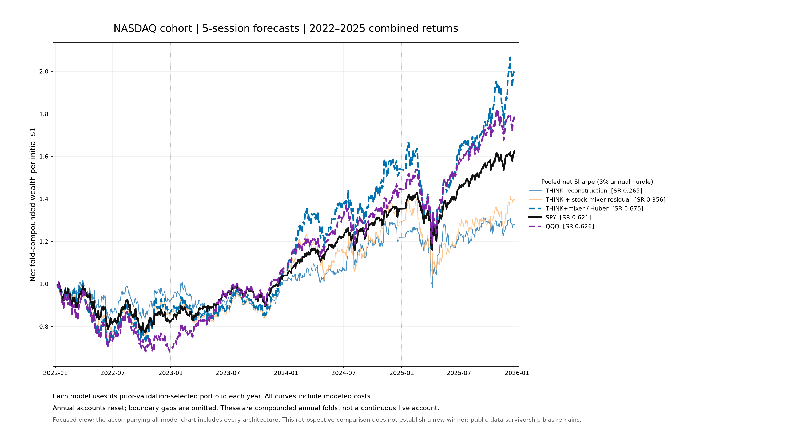

# Combined 2022–2025 model and ETF comparison

These charts combine the saved annual backtest returns without changing predictions, portfolios or costs. All original pooled gross/net performance metrics were recomputed and verified against the previous report. QQQ now also has a complete standalone pooled performance row.

**Interpretation:** annual accounts reset to cash, sizing restarts at $1m and boundary sessions are omitted. Compounding their returns creates a synthetic research curve, not an uninterrupted four-year live account. Each horizon uses its own exact matched-date ETF calendar. Differences between daily and five-session ETF Sharpes reflect those calendars. Sharpe uses 252 sessions and a fixed 3% annual hurdle.

Every model keeps its separately validation-selected portfolio for each year. The highlighted hybrid is an exploratory candidate identified after seeing results, not the validation-selected architecture procedure. Its NASDAQ five-session Sharpe remains **0.675**, versus **SPY 0.621** and **QQQ 0.626**. The existing confidence intervals include zero advantage.

[All metrics CSV](combined_2022_2025_metrics.csv) | [Underlying dated returns and curves](combined_2022_2025_curves.csv)

## NASDAQ cohort, 5-session forecasts

### Investment metrics

| Model / control | Gross SR | Net SR | Ann. net return | Cum. net return | Ann. volatility | Max drawdown | Annual turnover | Profitable days | Profitable evaluation periods |
| --- | --- | --- | --- | --- | --- | --- | --- | --- | --- |
| THINK reconstruction | 0.372 | 0.265 | 6.6% | 28.0% | 22.1% | -24.1% | 27.771 | 50.8% | 51.8% |
| THINK + ranking loss | 0.343 | 0.222 | 5.6% | 23.4% | 20.7% | -21.4% | 29.342 | 50.7% | 52.3% |
| THINK + market feature gate | 0.454 | 0.361 | 8.7% | 38.1% | 21.0% | -20.7% | 22.917 | 51.5% | 52.3% |
| THINK + stock mixer residual | 0.386 | 0.356 | 9.0% | 39.6% | 24.0% | -25.8% | 8.672 | 50.7% | 54.4% |
| THINK + volatility auxiliary task | 0.366 | 0.259 | 6.4% | 27.3% | 21.7% | -24.7% | 26.670 | 49.7% | 52.8% |
| Shared MLP | 0.403 | 0.291 | 7.3% | 31.3% | 23.4% | -24.2% | 30.282 | 49.9% | 52.3% |
| LSTM | 0.688 | 0.599 | 15.1% | 72.2% | 22.8% | -21.7% | 23.750 | 50.8% | 55.9% |
| StockMixer-inspired MLP | 0.508 | 0.381 | 9.6% | 42.7% | 23.7% | -26.3% | 34.676 | 50.8% | 52.3% |
| MASTER-inspired Transformer | 0.194 | 0.059 | 2.0% | 7.8% | 21.3% | -26.9% | 33.580 | 49.3% | 52.3% |
| THINK / Huber | 0.323 | 0.228 | 5.7% | 23.8% | 20.2% | -22.7% | 21.905 | 50.1% | 53.8% |
| THINK+mixer / Huber | 0.690 | 0.675 | 19.5% | 99.5% | 27.8% | -30.0% | 5.212 | 52.8% | 56.4% |
| StockMixer / Huber | 0.497 | 0.364 | 9.2% | 40.6% | 23.8% | -26.5% | 36.851 | 50.7% | 55.4% |
| THINK+mixer x0.1 / MSE | 0.498 | 0.452 | 11.4% | 51.8% | 23.4% | -23.3% | 12.296 | 50.6% | 53.8% |
| THINK+mixer x0.1 / Huber | 0.643 | 0.620 | 16.4% | 79.8% | 24.5% | -26.0% | 6.722 | 50.7% | 55.4% |
| Multi-scale mixer / MSE | 0.542 | 0.448 | 11.1% | 50.2% | 22.5% | -24.1% | 25.102 | 51.1% | 51.8% |
| Multi-scale mixer / Huber | 0.513 | 0.419 | 10.0% | 44.6% | 20.8% | -23.8% | 22.854 | 49.3% | 53.3% |
| Ridge regression | 0.354 | 0.194 | 4.9% | 20.5% | 21.9% | -26.7% | 41.521 | 51.3% | 56.4% |
| 126-session momentum | 0.417 | 0.381 | 9.3% | 40.9% | 21.6% | -22.7% | 8.996 | 51.5% | 58.5% |
| 5-session reversal | 0.348 | 0.204 | 5.2% | 21.6% | 21.5% | -27.7% | 36.133 | 51.0% | 52.3% |
| Equal-weight buy-and-hold | 0.349 | 0.341 | 8.0% | 34.9% | 19.7% | -23.0% | 2.014 | 50.4% | 54.4% |
| Equal-weight rebalanced universe | 0.381 | 0.364 | 8.7% | 38.1% | 20.7% | -22.2% | 4.298 | 50.2% | 54.4% |
| SPY | 0.629 | 0.621 | 13.4% | 62.7% | 18.1% | -23.4% | 2.068 | 54.6% | 62.1% |
| QQQ | 0.632 | 0.626 | 16.2% | 78.8% | 23.8% | -32.4% | 2.068 | 55.2% | 60.5% |

### Ranking metrics

| Model / control | IC | RankIC | ICIR | RankICIR | NDCG@5 | NDCG@10 | NDCG@20 |
| --- | --- | --- | --- | --- | --- | --- | --- |
| THINK reconstruction | 0.002 | 0.013 | 0.013 | 0.068 | 0.522 | 0.543 | 0.583 |
| THINK + ranking loss | 0.000 | 0.010 | 0.000 | 0.055 | 0.516 | 0.541 | 0.582 |
| THINK + market feature gate | 0.002 | 0.011 | 0.009 | 0.057 | 0.518 | 0.540 | 0.581 |
| THINK + stock mixer residual | 0.005 | -0.000 | 0.027 | -0.001 | 0.525 | 0.537 | 0.579 |
| THINK + volatility auxiliary task | -0.002 | 0.006 | -0.011 | 0.032 | 0.517 | 0.537 | 0.580 |
| Shared MLP | 0.005 | 0.007 | 0.025 | 0.037 | 0.538 | 0.546 | 0.588 |
| LSTM | 0.003 | 0.010 | 0.018 | 0.051 | 0.525 | 0.539 | 0.582 |
| StockMixer-inspired MLP | 0.008 | 0.004 | 0.044 | 0.024 | 0.514 | 0.537 | 0.578 |
| MASTER-inspired Transformer | -0.009 | -0.003 | -0.050 | -0.016 | 0.503 | 0.528 | 0.573 |
| THINK / Huber | -0.009 | -0.004 | -0.057 | -0.025 | 0.512 | 0.532 | 0.578 |
| THINK+mixer / Huber | 0.012 | 0.011 | 0.064 | 0.059 | 0.529 | 0.547 | 0.585 |
| StockMixer / Huber | 0.002 | 0.004 | 0.008 | 0.020 | 0.515 | 0.532 | 0.579 |
| THINK+mixer x0.1 / MSE | 0.007 | 0.004 | 0.042 | 0.024 | 0.513 | 0.536 | 0.577 |
| THINK+mixer x0.1 / Huber | 0.013 | 0.010 | 0.069 | 0.052 | 0.518 | 0.539 | 0.582 |
| Multi-scale mixer / MSE | 0.008 | 0.011 | 0.048 | 0.066 | 0.522 | 0.542 | 0.586 |
| Multi-scale mixer / Huber | -0.003 | -0.003 | -0.019 | -0.017 | 0.517 | 0.534 | 0.579 |
| Ridge regression | 0.012 | 0.001 | 0.057 | 0.006 | 0.523 | 0.539 | 0.582 |
| 126-session momentum | -0.002 | 0.005 | -0.007 | 0.026 | 0.503 | 0.527 | 0.576 |
| 5-session reversal | 0.005 | 0.009 | 0.022 | 0.044 | 0.506 | 0.532 | 0.576 |
| Equal-weight buy-and-hold | — | — | — | — | — | — | — |
| Equal-weight rebalanced universe | — | — | — | — | — | — | — |
| SPY | — | — | — | — | — | — | — |
| QQQ | — | — | — | — | — | — | — |

### Sharpe confidence intervals

Exploratory 95% paired block-bootstrap intervals. Difference intervals are for model Sharpe minus ETF Sharpe, not for the model Sharpe itself. [Method and full uncertainty tables](CONFIDENCE_INTERVALS.md).

| Model / control | Net SR | 95% SR CI | ΔSR vs SPY | 95% ΔSR CI | ΔSR vs QQQ | 95% ΔSR CI |
|---|---:|---|---:|---|---:|---|
| THINK reconstruction | 0.265 | [-0.532, 1.167] | -0.356 | [-0.846, 0.191] | -0.361 | [-0.935, 0.279] |
| THINK + ranking loss | 0.222 | [-0.595, 1.041] | -0.399 | [-0.883, 0.143] | -0.403 | [-0.982, 0.227] |
| THINK + market feature gate | 0.361 | [-0.455, 1.253] | -0.261 | [-0.739, 0.279] | -0.265 | [-0.873, 0.366] |
| THINK + stock mixer residual | 0.356 | [-0.564, 1.299] | -0.265 | [-0.706, 0.263] | -0.270 | [-0.843, 0.358] |
| THINK + volatility auxiliary task | 0.259 | [-0.559, 1.075] | -0.362 | [-0.840, 0.139] | -0.367 | [-0.974, 0.233] |
| Shared MLP | 0.291 | [-0.535, 1.142] | -0.331 | [-0.885, 0.230] | -0.335 | [-0.957, 0.347] |
| LSTM | 0.599 | [-0.266, 1.562] | -0.022 | [-0.632, 0.537] | -0.026 | [-0.706, 0.661] |
| StockMixer-inspired MLP | 0.381 | [-0.606, 1.386] | -0.241 | [-0.802, 0.379] | -0.245 | [-0.921, 0.499] |
| MASTER-inspired Transformer | 0.059 | [-0.851, 0.934] | -0.563 | [-1.140, -0.040] | -0.567 | [-1.153, 0.018] |
| THINK / Huber | 0.228 | [-0.599, 1.067] | -0.393 | [-0.962, 0.200] | -0.398 | [-1.063, 0.259] |
| THINK+mixer / Huber | 0.675 | [-0.264, 1.652] | 0.053 | [-0.396, 0.524] | 0.049 | [-0.445, 0.596] |
| StockMixer / Huber | 0.364 | [-0.511, 1.380] | -0.257 | [-0.784, 0.287] | -0.261 | [-0.889, 0.404] |
| THINK+mixer x0.1 / MSE | 0.452 | [-0.430, 1.315] | -0.170 | [-0.663, 0.371] | -0.174 | [-0.778, 0.468] |
| THINK+mixer x0.1 / Huber | 0.620 | [-0.274, 1.546] | -0.002 | [-0.427, 0.440] | -0.006 | [-0.527, 0.528] |
| Multi-scale mixer / MSE | 0.448 | [-0.455, 1.377] | -0.173 | [-0.658, 0.336] | -0.178 | [-0.784, 0.445] |
| Multi-scale mixer / Huber | 0.419 | [-0.430, 1.339] | -0.202 | [-0.652, 0.260] | -0.206 | [-0.748, 0.376] |
| Ridge regression | 0.194 | [-0.697, 1.133] | -0.427 | [-0.860, 0.046] | -0.432 | [-0.998, 0.147] |
| 126-session momentum | 0.381 | [-0.405, 1.225] | -0.240 | [-0.812, 0.303] | -0.245 | [-0.863, 0.397] |
| 5-session reversal | 0.204 | [-0.615, 1.041] | -0.417 | [-1.038, 0.169] | -0.421 | [-1.102, 0.269] |
| Equal-weight buy-and-hold | 0.341 | [-0.490, 1.255] | -0.281 | [-0.705, 0.161] | -0.285 | [-0.830, 0.274] |
| Equal-weight rebalanced universe | 0.364 | [-0.472, 1.283] | -0.258 | [-0.695, 0.191] | -0.262 | [-0.816, 0.339] |
| SPY | 0.621 | [-0.215, 1.542] | 0.000 | [0.000, 0.000] | -0.004 | [-0.290, 0.271] |
| QQQ | 0.626 | [-0.234, 1.524] | 0.004 | [-0.271, 0.290] | 0.000 | [0.000, 0.000] |

## NYSE cohort, 5-session forecasts

### Investment metrics

| Model / control | Gross SR | Net SR | Ann. net return | Cum. net return | Ann. volatility | Max drawdown | Annual turnover | Profitable days | Profitable evaluation periods |
| --- | --- | --- | --- | --- | --- | --- | --- | --- | --- |
| THINK reconstruction | 0.127 | 0.017 | 1.5% | 5.9% | 19.0% | -25.8% | 24.504 | 51.7% | 54.9% |
| THINK + ranking loss | -0.026 | -0.185 | -2.1% | -8.1% | 18.5% | -33.2% | 33.616 | 49.9% | 51.8% |
| THINK + market feature gate | 0.237 | 0.096 | 3.1% | 12.6% | 18.0% | -24.2% | 29.207 | 50.5% | 54.9% |
| THINK + stock mixer residual | 0.341 | 0.301 | 7.4% | 31.6% | 21.4% | -22.4% | 10.248 | 51.1% | 55.9% |
| THINK + volatility auxiliary task | -0.164 | -0.246 | -4.2% | -15.3% | 20.7% | -38.1% | 19.460 | 49.9% | 53.3% |
| Shared MLP | -0.130 | -0.237 | -5.7% | -20.2% | 24.4% | -41.4% | 30.778 | 49.9% | 51.8% |
| LSTM | 0.128 | -0.011 | 0.8% | 3.0% | 19.9% | -21.3% | 33.181 | 50.4% | 50.8% |
| StockMixer-inspired MLP | -0.004 | -0.118 | -2.4% | -9.0% | 23.1% | -34.8% | 31.591 | 51.5% | 50.8% |
| MASTER-inspired Transformer | -0.185 | -0.328 | -7.0% | -24.5% | 23.1% | -38.8% | 38.358 | 49.1% | 48.7% |
| THINK / Huber | 0.131 | -0.054 | 0.6% | 2.4% | 16.9% | -24.4% | 35.827 | 51.0% | 54.9% |
| THINK+mixer / Huber | 0.218 | 0.194 | 5.0% | 20.6% | 18.2% | -20.7% | 5.378 | 51.3% | 57.4% |
| StockMixer / Huber | -0.029 | -0.157 | -1.8% | -6.7% | 18.9% | -19.3% | 28.733 | 50.6% | 51.8% |
| THINK+mixer x0.1 / MSE | 0.139 | 0.075 | 2.2% | 8.9% | 22.0% | -24.9% | 16.420 | 49.8% | 53.8% |
| THINK+mixer x0.1 / Huber | -0.136 | -0.176 | -3.6% | -13.2% | 22.8% | -35.8% | 10.591 | 50.5% | 52.3% |
| Multi-scale mixer / MSE | 0.003 | -0.114 | -1.7% | -6.4% | 21.2% | -23.7% | 29.735 | 49.6% | 49.2% |
| Multi-scale mixer / Huber | -0.014 | -0.113 | -1.4% | -5.5% | 20.5% | -25.3% | 24.408 | 50.2% | 51.3% |
| Ridge regression | 0.185 | -0.030 | -0.5% | -1.8% | 23.4% | -28.5% | 58.520 | 50.2% | 49.7% |
| 126-session momentum | 0.447 | 0.393 | 8.9% | 39.2% | 18.7% | -21.4% | 11.939 | 52.7% | 56.4% |
| 5-session reversal | 0.257 | -0.007 | 0.8% | 3.2% | 20.0% | -33.9% | 61.954 | 49.2% | 50.8% |
| Equal-weight buy-and-hold | 0.222 | 0.213 | 5.3% | 22.1% | 17.6% | -19.8% | 2.027 | 51.3% | 57.4% |
| Equal-weight rebalanced universe | 0.196 | 0.179 | 4.7% | 19.3% | 18.4% | -19.9% | 4.096 | 51.1% | 55.9% |
| SPY | 0.629 | 0.621 | 13.4% | 62.7% | 18.1% | -23.4% | 2.068 | 54.6% | 62.1% |
| QQQ | 0.632 | 0.626 | 16.2% | 78.8% | 23.8% | -32.4% | 2.068 | 55.2% | 60.5% |

### Ranking metrics

| Model / control | IC | RankIC | ICIR | RankICIR | NDCG@5 | NDCG@10 | NDCG@20 |
| --- | --- | --- | --- | --- | --- | --- | --- |
| THINK reconstruction | 0.005 | -0.001 | 0.037 | -0.010 | 0.516 | 0.528 | 0.573 |
| THINK + ranking loss | 0.004 | -0.001 | 0.028 | -0.004 | 0.518 | 0.533 | 0.574 |
| THINK + market feature gate | 0.006 | -0.001 | 0.039 | -0.009 | 0.514 | 0.531 | 0.574 |
| THINK + stock mixer residual | 0.012 | 0.021 | 0.070 | 0.125 | 0.514 | 0.533 | 0.576 |
| THINK + volatility auxiliary task | -0.007 | -0.010 | -0.047 | -0.067 | 0.505 | 0.527 | 0.570 |
| Shared MLP | -0.008 | -0.015 | -0.040 | -0.074 | 0.519 | 0.532 | 0.569 |
| LSTM | 0.004 | -0.001 | 0.022 | -0.008 | 0.516 | 0.531 | 0.570 |
| StockMixer-inspired MLP | -0.013 | -0.013 | -0.074 | -0.076 | 0.516 | 0.536 | 0.569 |
| MASTER-inspired Transformer | 0.003 | 0.006 | 0.018 | 0.034 | 0.499 | 0.522 | 0.569 |
| THINK / Huber | 0.013 | 0.005 | 0.090 | 0.037 | 0.512 | 0.533 | 0.574 |
| THINK+mixer / Huber | 0.010 | 0.017 | 0.057 | 0.099 | 0.516 | 0.534 | 0.575 |
| StockMixer / Huber | -0.019 | -0.018 | -0.119 | -0.113 | 0.506 | 0.517 | 0.562 |
| THINK+mixer x0.1 / MSE | 0.003 | 0.010 | 0.021 | 0.059 | 0.511 | 0.532 | 0.570 |
| THINK+mixer x0.1 / Huber | 0.001 | 0.007 | 0.005 | 0.041 | 0.508 | 0.527 | 0.569 |
| Multi-scale mixer / MSE | -0.009 | -0.019 | -0.053 | -0.111 | 0.512 | 0.526 | 0.562 |
| Multi-scale mixer / Huber | -0.015 | -0.019 | -0.088 | -0.107 | 0.507 | 0.529 | 0.568 |
| Ridge regression | 0.010 | 0.002 | 0.053 | 0.013 | 0.532 | 0.541 | 0.576 |
| 126-session momentum | 0.005 | 0.009 | 0.022 | 0.044 | 0.514 | 0.531 | 0.575 |
| 5-session reversal | 0.026 | 0.030 | 0.139 | 0.170 | 0.518 | 0.538 | 0.582 |
| Equal-weight buy-and-hold | — | — | — | — | — | — | — |
| Equal-weight rebalanced universe | — | — | — | — | — | — | — |
| SPY | — | — | — | — | — | — | — |
| QQQ | — | — | — | — | — | — | — |

### Sharpe confidence intervals

Exploratory 95% paired block-bootstrap intervals. Difference intervals are for model Sharpe minus ETF Sharpe, not for the model Sharpe itself. [Method and full uncertainty tables](CONFIDENCE_INTERVALS.md).

| Model / control | Net SR | 95% SR CI | ΔSR vs SPY | 95% ΔSR CI | ΔSR vs QQQ | 95% ΔSR CI |
|---|---:|---|---:|---|---:|---|
| THINK reconstruction | 0.017 | [-0.974, 0.972] | -0.605 | [-1.178, -0.094] | -0.609 | [-1.344, 0.072] |
| THINK + ranking loss | -0.185 | [-1.204, 0.861] | -0.806 | [-1.419, -0.233] | -0.810 | [-1.603, -0.109] |
| THINK + market feature gate | 0.096 | [-0.874, 1.018] | -0.525 | [-1.074, -0.001] | -0.530 | [-1.267, 0.162] |
| THINK + stock mixer residual | 0.301 | [-0.640, 1.181] | -0.321 | [-0.942, 0.285] | -0.325 | [-1.100, 0.426] |
| THINK + volatility auxiliary task | -0.246 | [-1.179, 0.719] | -0.867 | [-1.455, -0.301] | -0.872 | [-1.537, -0.171] |
| Shared MLP | -0.237 | [-1.067, 0.552] | -0.859 | [-1.549, -0.257] | -0.863 | [-1.593, -0.153] |
| LSTM | -0.011 | [-0.849, 0.840] | -0.632 | [-1.170, -0.101] | -0.637 | [-1.313, 0.063] |
| StockMixer-inspired MLP | -0.118 | [-0.995, 0.687] | -0.739 | [-1.343, -0.220] | -0.744 | [-1.450, -0.064] |
| MASTER-inspired Transformer | -0.328 | [-1.117, 0.461] | -0.949 | [-1.598, -0.308] | -0.953 | [-1.748, -0.242] |
| THINK / Huber | -0.054 | [-1.015, 0.907] | -0.675 | [-1.248, -0.124] | -0.680 | [-1.439, 0.001] |
| THINK+mixer / Huber | 0.194 | [-0.716, 1.151] | -0.427 | [-0.929, 0.053] | -0.432 | [-1.115, 0.199] |
| StockMixer / Huber | -0.157 | [-1.040, 0.706] | -0.778 | [-1.322, -0.265] | -0.782 | [-1.442, -0.128] |
| THINK+mixer x0.1 / MSE | 0.075 | [-0.830, 1.021] | -0.546 | [-1.174, 0.061] | -0.551 | [-1.268, 0.192] |
| THINK+mixer x0.1 / Huber | -0.176 | [-1.059, 0.745] | -0.797 | [-1.417, -0.169] | -0.802 | [-1.516, -0.094] |
| Multi-scale mixer / MSE | -0.114 | [-0.950, 0.691] | -0.735 | [-1.365, -0.183] | -0.740 | [-1.470, -0.044] |
| Multi-scale mixer / Huber | -0.113 | [-1.005, 0.773] | -0.734 | [-1.354, -0.144] | -0.738 | [-1.487, -0.017] |
| Ridge regression | -0.030 | [-0.885, 0.791] | -0.651 | [-1.376, 0.006] | -0.656 | [-1.421, 0.082] |
| 126-session momentum | 0.393 | [-0.507, 1.381] | -0.228 | [-0.809, 0.328] | -0.233 | [-0.962, 0.475] |
| 5-session reversal | -0.007 | [-0.873, 0.845] | -0.628 | [-1.366, 0.118] | -0.633 | [-1.514, 0.228] |
| Equal-weight buy-and-hold | 0.213 | [-0.707, 1.134] | -0.408 | [-0.902, 0.081] | -0.413 | [-1.079, 0.247] |
| Equal-weight rebalanced universe | 0.179 | [-0.720, 1.082] | -0.443 | [-0.942, 0.052] | -0.447 | [-1.104, 0.215] |
| SPY | 0.621 | [-0.215, 1.542] | 0.000 | [0.000, 0.000] | -0.004 | [-0.290, 0.271] |
| QQQ | 0.626 | [-0.234, 1.524] | 0.004 | [-0.271, 0.290] | 0.000 | [0.000, 0.000] |

## NASDAQ cohort, 1-session forecasts

### Investment metrics

| Model / control | Gross SR | Net SR | Ann. net return | Cum. net return | Ann. volatility | Max drawdown | Annual turnover | Profitable days | Profitable evaluation periods |
| --- | --- | --- | --- | --- | --- | --- | --- | --- | --- |
| THINK reconstruction | 0.300 | -0.097 | -1.4% | -5.4% | 21.4% | -27.6% | 101.201 | 49.1% | 49.1% |
| THINK / Huber | 0.336 | -0.182 | -2.5% | -9.7% | 19.7% | -26.7% | 118.549 | 47.5% | 47.5% |
| THINK + stock mixer residual | 0.526 | 0.383 | 10.0% | 45.6% | 25.8% | -32.6% | 44.574 | 50.8% | 50.8% |
| THINK+mixer / Huber | 0.336 | 0.291 | 7.3% | 32.2% | 23.8% | -28.4% | 13.040 | 50.5% | 50.5% |
| StockMixer-inspired MLP | 0.396 | 0.055 | 1.4% | 5.7% | 24.1% | -26.9% | 94.704 | 49.9% | 49.9% |
| StockMixer / Huber | 0.524 | 0.251 | 6.3% | 27.2% | 23.0% | -25.8% | 75.315 | 49.8% | 49.8% |
| Multi-scale mixer / MSE | 0.423 | 0.161 | 4.1% | 17.0% | 23.9% | -27.1% | 73.642 | 49.3% | 49.3% |
| Multi-scale mixer / Huber | 0.416 | 0.088 | 2.5% | 10.1% | 22.2% | -26.0% | 87.100 | 49.1% | 49.1% |
| Ridge regression | 0.017 | -0.842 | -15.7% | -49.0% | 21.1% | -60.3% | 211.973 | 46.3% | 46.3% |
| 126-session momentum | 0.080 | -0.004 | 0.5% | 1.8% | 22.0% | -33.7% | 21.592 | 50.4% | 50.4% |
| 5-session reversal | 0.171 | -0.092 | -1.7% | -6.6% | 22.8% | -28.2% | 70.228 | 50.2% | 50.2% |
| Equal-weight buy-and-hold | 0.259 | 0.251 | 6.2% | 26.6% | 19.9% | -24.5% | 1.993 | 49.6% | 49.6% |
| Equal-weight rebalanced universe | 0.281 | 0.255 | 6.3% | 27.2% | 20.7% | -23.6% | 6.585 | 49.8% | 49.8% |
| SPY | 0.505 | 0.497 | 10.8% | 50.2% | 18.1% | -24.5% | 2.026 | 54.0% | 54.0% |
| QQQ | 0.505 | 0.499 | 12.7% | 60.5% | 23.7% | -34.0% | 2.026 | 54.4% | 54.4% |

### Ranking metrics

| Model / control | IC | RankIC | ICIR | RankICIR | NDCG@5 | NDCG@10 | NDCG@20 |
| --- | --- | --- | --- | --- | --- | --- | --- |
| THINK reconstruction | 0.002 | -0.001 | 0.011 | -0.007 | 0.506 | 0.530 | 0.576 |
| THINK / Huber | -0.002 | -0.000 | -0.010 | -0.001 | 0.510 | 0.530 | 0.576 |
| THINK + stock mixer residual | 0.007 | 0.007 | 0.046 | 0.042 | 0.519 | 0.537 | 0.581 |
| THINK+mixer / Huber | 0.004 | 0.005 | 0.024 | 0.030 | 0.517 | 0.535 | 0.580 |
| StockMixer-inspired MLP | 0.000 | -0.001 | 0.003 | -0.007 | 0.520 | 0.536 | 0.579 |
| StockMixer / Huber | 0.004 | 0.003 | 0.023 | 0.016 | 0.515 | 0.532 | 0.579 |
| Multi-scale mixer / MSE | 0.004 | 0.002 | 0.020 | 0.010 | 0.519 | 0.537 | 0.580 |
| Multi-scale mixer / Huber | 0.005 | 0.004 | 0.030 | 0.020 | 0.518 | 0.536 | 0.581 |
| Ridge regression | 0.002 | -0.001 | 0.009 | -0.003 | 0.509 | 0.530 | 0.576 |
| 126-session momentum | 0.005 | 0.013 | 0.022 | 0.056 | 0.517 | 0.537 | 0.583 |
| 5-session reversal | 0.008 | 0.005 | 0.036 | 0.025 | 0.514 | 0.536 | 0.578 |
| Equal-weight buy-and-hold | — | — | — | — | — | — | — |
| Equal-weight rebalanced universe | — | — | — | — | — | — | — |
| SPY | — | — | — | — | — | — | — |
| QQQ | — | — | — | — | — | — | — |

### Sharpe confidence intervals

Exploratory 95% paired block-bootstrap intervals. Difference intervals are for model Sharpe minus ETF Sharpe, not for the model Sharpe itself. [Method and full uncertainty tables](CONFIDENCE_INTERVALS.md).

| Model / control | Net SR | 95% SR CI | ΔSR vs SPY | 95% ΔSR CI | ΔSR vs QQQ | 95% ΔSR CI |
|---|---:|---|---:|---|---:|---|
| THINK reconstruction | -0.097 | [-0.973, 0.789] | -0.594 | [-1.111, -0.075] | -0.596 | [-1.232, 0.066] |
| THINK / Huber | -0.182 | [-0.998, 0.669] | -0.678 | [-1.172, -0.179] | -0.681 | [-1.264, -0.055] |
| THINK + stock mixer residual | 0.383 | [-0.515, 1.373] | -0.113 | [-0.649, 0.400] | -0.115 | [-0.730, 0.517] |
| THINK+mixer / Huber | 0.291 | [-0.542, 1.137] | -0.206 | [-0.710, 0.305] | -0.208 | [-0.832, 0.456] |
| StockMixer-inspired MLP | 0.055 | [-0.810, 0.989] | -0.442 | [-0.988, 0.080] | -0.444 | [-1.090, 0.199] |
| StockMixer / Huber | 0.251 | [-0.609, 1.121] | -0.246 | [-0.726, 0.239] | -0.248 | [-0.836, 0.338] |
| Multi-scale mixer / MSE | 0.161 | [-0.689, 0.987] | -0.335 | [-0.834, 0.156] | -0.337 | [-0.927, 0.257] |
| Multi-scale mixer / Huber | 0.088 | [-0.743, 0.970] | -0.409 | [-0.907, 0.117] | -0.411 | [-1.020, 0.224] |
| Ridge regression | -0.842 | [-1.705, 0.029] | -1.339 | [-1.909, -0.770] | -1.341 | [-1.989, -0.653] |
| 126-session momentum | -0.004 | [-0.808, 0.826] | -0.501 | [-1.054, 0.051] | -0.503 | [-1.122, 0.142] |
| 5-session reversal | -0.092 | [-0.840, 0.696] | -0.588 | [-1.189, -0.002] | -0.590 | [-1.250, 0.079] |
| Equal-weight buy-and-hold | 0.251 | [-0.576, 1.087] | -0.246 | [-0.684, 0.186] | -0.248 | [-0.784, 0.300] |
| Equal-weight rebalanced universe | 0.255 | [-0.570, 1.090] | -0.241 | [-0.684, 0.197] | -0.243 | [-0.780, 0.316] |
| SPY | 0.497 | [-0.341, 1.360] | 0.000 | [0.000, 0.000] | -0.002 | [-0.264, 0.263] |
| QQQ | 0.499 | [-0.333, 1.399] | 0.002 | [-0.263, 0.264] | 0.000 | [0.000, 0.000] |

## NYSE cohort, 1-session forecasts

### Investment metrics

| Model / control | Gross SR | Net SR | Ann. net return | Cum. net return | Ann. volatility | Max drawdown | Annual turnover | Profitable days | Profitable evaluation periods |
| --- | --- | --- | --- | --- | --- | --- | --- | --- | --- |
| THINK reconstruction | 0.314 | -0.262 | -4.2% | -15.7% | 20.1% | -36.9% | 134.818 | 50.3% | 50.3% |
| THINK / Huber | 0.100 | -0.597 | -9.3% | -31.9% | 18.4% | -42.3% | 149.463 | 48.9% | 48.9% |
| THINK + stock mixer residual | -0.203 | -0.229 | -5.9% | -21.2% | 25.3% | -39.0% | 8.355 | 49.7% | 49.7% |
| THINK+mixer / Huber | -0.092 | -0.180 | -3.4% | -12.7% | 22.1% | -35.9% | 23.241 | 49.9% | 49.9% |
| StockMixer-inspired MLP | 0.132 | -0.217 | -5.0% | -18.5% | 24.1% | -33.0% | 97.991 | 48.2% | 48.2% |
| StockMixer / Huber | -0.047 | -0.482 | -8.9% | -30.7% | 20.9% | -40.1% | 106.260 | 49.1% | 49.1% |
| Multi-scale mixer / MSE | -0.176 | -0.397 | -8.4% | -29.1% | 22.9% | -44.3% | 60.109 | 48.5% | 48.5% |
| Multi-scale mixer / Huber | 0.100 | -0.329 | -6.3% | -22.5% | 21.6% | -40.9% | 107.100 | 49.1% | 49.1% |
| Ridge regression | -0.066 | -0.939 | -16.9% | -52.0% | 20.7% | -58.2% | 212.248 | 48.2% | 48.2% |
| 126-session momentum | 0.163 | 0.079 | 2.4% | 10.0% | 21.0% | -27.4% | 20.671 | 50.7% | 50.7% |
| 5-session reversal | 0.203 | -0.226 | -4.0% | -15.0% | 21.3% | -34.1% | 106.181 | 50.6% | 50.6% |
| Equal-weight buy-and-hold | 0.148 | 0.139 | 3.9% | 16.4% | 17.6% | -20.3% | 1.998 | 50.9% | 50.9% |
| Equal-weight rebalanced universe | 0.113 | 0.086 | 2.9% | 11.9% | 18.3% | -21.0% | 6.352 | 50.5% | 50.5% |
| SPY | 0.505 | 0.497 | 10.8% | 50.2% | 18.1% | -24.5% | 2.026 | 54.0% | 54.0% |
| QQQ | 0.505 | 0.499 | 12.7% | 60.5% | 23.7% | -34.0% | 2.026 | 54.4% | 54.4% |

### Ranking metrics

| Model / control | IC | RankIC | ICIR | RankICIR | NDCG@5 | NDCG@10 | NDCG@20 |
| --- | --- | --- | --- | --- | --- | --- | --- |
| THINK reconstruction | 0.002 | -0.004 | 0.013 | -0.021 | 0.519 | 0.534 | 0.573 |
| THINK / Huber | 0.004 | -0.002 | 0.024 | -0.012 | 0.515 | 0.532 | 0.572 |
| THINK + stock mixer residual | 0.001 | 0.007 | 0.003 | 0.040 | 0.511 | 0.532 | 0.572 |
| THINK+mixer / Huber | 0.001 | 0.006 | 0.006 | 0.038 | 0.512 | 0.531 | 0.570 |
| StockMixer-inspired MLP | -0.004 | -0.004 | -0.022 | -0.022 | 0.513 | 0.531 | 0.571 |
| StockMixer / Huber | -0.002 | -0.002 | -0.012 | -0.009 | 0.512 | 0.531 | 0.572 |
| Multi-scale mixer / MSE | -0.007 | -0.009 | -0.033 | -0.042 | 0.515 | 0.530 | 0.570 |
| Multi-scale mixer / Huber | 0.000 | 0.001 | 0.001 | 0.007 | 0.516 | 0.531 | 0.574 |
| Ridge regression | 0.001 | -0.002 | 0.007 | -0.011 | 0.509 | 0.529 | 0.570 |
| 126-session momentum | 0.004 | 0.007 | 0.016 | 0.034 | 0.514 | 0.534 | 0.576 |
| 5-session reversal | 0.012 | 0.014 | 0.057 | 0.073 | 0.517 | 0.534 | 0.576 |
| Equal-weight buy-and-hold | — | — | — | — | — | — | — |
| Equal-weight rebalanced universe | — | — | — | — | — | — | — |
| SPY | — | — | — | — | — | — | — |
| QQQ | — | — | — | — | — | — | — |

### Sharpe confidence intervals

Exploratory 95% paired block-bootstrap intervals. Difference intervals are for model Sharpe minus ETF Sharpe, not for the model Sharpe itself. [Method and full uncertainty tables](CONFIDENCE_INTERVALS.md).

| Model / control | Net SR | 95% SR CI | ΔSR vs SPY | 95% ΔSR CI | ΔSR vs QQQ | 95% ΔSR CI |
|---|---:|---|---:|---|---:|---|
| THINK reconstruction | -0.262 | [-1.078, 0.606] | -0.759 | [-1.297, -0.200] | -0.761 | [-1.428, -0.070] |
| THINK / Huber | -0.597 | [-1.435, 0.305] | -1.094 | [-1.712, -0.513] | -1.096 | [-1.817, -0.357] |
| THINK + stock mixer residual | -0.229 | [-1.018, 0.613] | -0.726 | [-1.386, -0.081] | -0.728 | [-1.461, 0.018] |
| THINK+mixer / Huber | -0.180 | [-1.016, 0.745] | -0.676 | [-1.258, -0.079] | -0.678 | [-1.385, 0.063] |
| StockMixer-inspired MLP | -0.217 | [-0.965, 0.646] | -0.714 | [-1.349, -0.080] | -0.716 | [-1.454, 0.040] |
| StockMixer / Huber | -0.482 | [-1.297, 0.376] | -0.979 | [-1.624, -0.311] | -0.981 | [-1.710, -0.199] |
| Multi-scale mixer / MSE | -0.397 | [-1.195, 0.427] | -0.893 | [-1.523, -0.291] | -0.895 | [-1.618, -0.164] |
| Multi-scale mixer / Huber | -0.329 | [-1.179, 0.579] | -0.825 | [-1.450, -0.218] | -0.827 | [-1.527, -0.103] |
| Ridge regression | -0.939 | [-1.797, -0.031] | -1.436 | [-2.065, -0.798] | -1.438 | [-2.167, -0.687] |
| 126-session momentum | 0.079 | [-0.823, 0.879] | -0.417 | [-0.980, 0.123] | -0.420 | [-1.092, 0.248] |
| 5-session reversal | -0.226 | [-1.019, 0.642] | -0.723 | [-1.358, -0.068] | -0.725 | [-1.497, 0.059] |
| Equal-weight buy-and-hold | 0.139 | [-0.739, 1.021] | -0.358 | [-0.812, 0.116] | -0.360 | [-0.993, 0.298] |
| Equal-weight rebalanced universe | 0.086 | [-0.784, 0.983] | -0.411 | [-0.872, 0.076] | -0.413 | [-1.022, 0.233] |
| SPY | 0.497 | [-0.341, 1.360] | 0.000 | [0.000, 0.000] | -0.002 | [-0.264, 0.263] |
| QQQ | 0.499 | [-0.333, 1.399] | 0.002 | [-0.263, 0.264] | 0.000 | [0.000, 0.000] |

## Focus: THINK, the mixer hybrid and ETF controls

Ranking metrics pool prediction periods across the eligible stock universe, not only portfolio holdings. ICIR/RankICIR are unannualized mean-to-standard-deviation ratios. Turnover and profitable-rebalance-period rates retain the original trading-day-weighted annual aggregation. ETF ranking metrics are undefined, shown as missing. ETF profitable evaluation periods use the same horizon-sized return blocks as model holding periods, without extra ETF rebalancing. Profitable trading days are reported for all curves. All gross metrics, zero-hurdle Sharpes and existing exploratory uncertainty intervals remain in the CSV.
