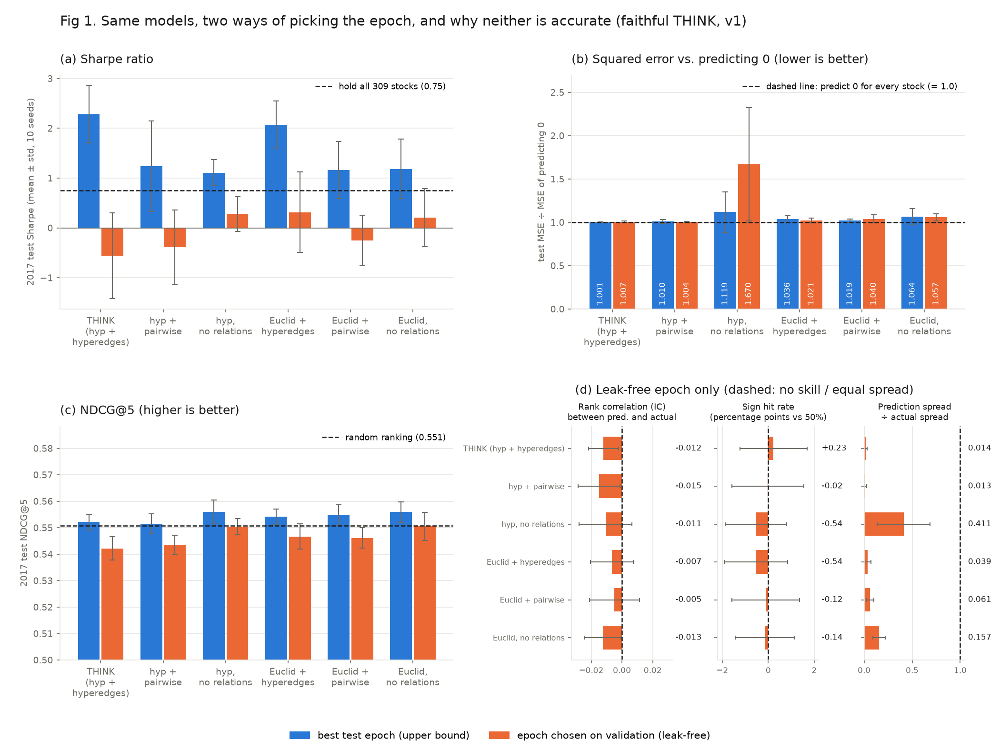
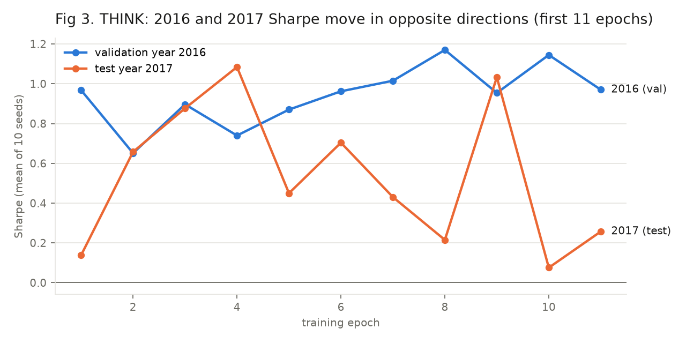
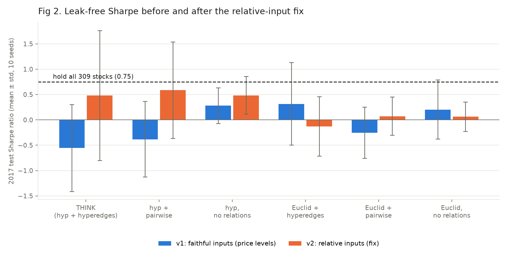

# THINK: Small-Scale Reproduction (309 NYSE stocks)

*Team update, 2026-09-28; corrections added 2026-09-29. Scope: the small-scale test only. The full-scale study is paused.*

> **Read this first (2026-09-29).**
> 1. **Every result in this document used the pre-fix hypergraph** (a star hyperedge for every Wikidata relation channel; 73 hyperedges on the 309 stocks). The paper builds second-order relations as pairs ([A854] Sec. B), and commit `de20f8e` fixed the builder (309-stock graph: now 558 edges). **Reruns on the corrected graph are queued on the second GPU queue ("g2")**; until they finish, all numbers below are old-graph numbers. See "Correction 2" in §4e.
> 2. **Our small-scale "hyperbolic vs Euclidean" contrasts compare HH with EE. That is not the paper's comparison.** The paper's Euclidean model is Euclidean temporal convolution + hyperbolic hypergraph attention (our EH; "TCONV + DHHAN", p852 Table II and Sec. V.A). The paper has no fully-Euclidean model.
> 3. **Our Sharpe is not the paper's formula.** The paper writes `E[R_a - R_f] / std[R_a - R_f]` with top-k and no annualization (p852 Sec. IV-B); ours is top-5, × √252, no R_f (RSR [1] code).
>
> Citations: `pNNN` = page of `05-Hypershift-OA.pdf` (pp849-853); `[A854]` = page 854 (appendices, Algorithm 1, refs 17-38) of `data/raw/icdm22-think.pdf`.

## 1. One-slide summary

- We reimplemented **THINK** (Temporal Hypergraph Hyperbolic Network, ICDM 2022) from scratch. The authors' code repo is empty (p852 footnote 1 names the URL; the emptiness is our own check).
- **All numbers in this document are on the pre-fix hypergraph; corrected-graph reruns are queued (see the note at the top and §4e).**
- On a 309-stock NYSE subset, **if the reported epoch is the one with the best 2017 (test) score, we reproduce the paper's story. The authors' earlier code allows that choice: it prints the test score every epoch and has no selection rule**:
  - THINK comes out best, at Sharpe **2.28**.
  - Hyperedges beat pairwise edges, which beat no relations.
- **Scored leak-free (epoch picked on the validation year), the advantage disappears.** THINK gets −0.56, no comparison is statistically significant, and nothing beats simply holding the 309 stocks (0.75).
- *Correction:* THINK's attention (eq. 14) used a close but not exact formula. It is now fixed and the two affected arms were rerun (§4d). **No conclusion changed:** the numbers moved by less than their seed-to-seed noise, and every statistical comparison is still "no evidence".
- **None of the models predicts returns.** Their squared error is no better than predicting 0 for every stock, their rankings score at or below a random ranking (NDCG@5), and their predictions collapse to near-constant values (THINK: ~1% of the real spread). So the high best-test-epoch Sharpe reflects choosing the epoch on the test year, not skill (§4b, cause 3).
- We found a hyperbolic-specific cause: **inputs sit at the edge of the hyperbolic ball.** A one-line fix (relative inputs) lifts THINK to +0.48 and puts hyperbolic ahead of Euclidean. It is still not significant.

## 2. What THINK does (the paper's method)

1. **Data:** RSR NYSE daily prices, 2013–2017.
   - Per stock-day features: the 5/10/20/30-day moving averages of close, and the close, each divided by the stock's max price.
   - The model sees 16 days × 5 features and predicts the next day's return.
2. **Hypergraph** ([A854] Sec. B, "Stock Datasets"):
   - industry hyperedges (stocks in the same industry);
   - plus Wikidata corporate hyperedges. First-order relation: "a hyperedge of a source stock and a set of target stocks related to it via the same Wikidata relation". Second-order relation (`X -R2-> Z <-R3- Y`): "pairwise in nature", i.e. a 2-node hyperedge.
3. **Model** (paper eq. 17): `ŷ = log₀(TConv₂(DHHAN(TConv₁(exp₀(X))), G))`
   - `exp₀` maps the features onto the Poincaré ball (hyperbolic space).
   - A hyperbolic temporal convolution (β-concatenation + Poincaré fully-connected layer) runs 16 days → 4 steps → 1.
   - DHHAN (distance-aware hyperbolic hypergraph attention) mixes information between stocks that share a hyperedge.
4. **Trading rule and metric:**
   - **Paper (p852 Sec. IV-B):** "Following [1], we adopt a daily-buy-hold trading strategy": rank all stocks by predicted return ratio, buy the top-k, sell at the next close. `SR = E[R_a - R_f] / std[R_a - R_f]`, where R_f is "a risk-free return". **k and R_f are not given, and there is no √252.**
   - **Ours (RSR [1] / STHAN-SR code definition; that the paper uses it is `INFERRED (not in paper)`):** buy the top 5 predicted stocks each test day, Sharpe = mean / std of the daily top-5 return × √252, R_f = 0, no costs. Our Sharpe values are therefore not directly comparable to the paper's 1.18.
5. **Paper's NYSE numbers:** THINK Sharpe **1.18**, TCONV+DHHAN 1.14, STHGCN 1.10.

## 3. What we did in the small-scale test

| Step | THINK paper | Our small-scale test | Same? |
|---|---|---|---|
| Dataset | RSR NYSE, 1737 stocks | RSR NYSE, **309 stocks** (12 industries: Energy/Utilities + Finance) | **Different** (subset) |
| Train / val / test | 2013–15 / 2016 / 2017 | same | Same |
| Features | MA5, MA10, MA20, MA30, close; 16-day window | same | Same |
| Price normalization | ÷ max over **all** years (includes the test year) | ÷ max over **training years only** | **Different** (theirs peeks at the future) |
| Hyperedges | industry + Wikidata relations; second-order relations are pairs ([A854] Sec. B) | **Pre-fix builder (all results here): a star for every Wikidata channel**, restricted to the 309 stocks (73 hyperedges). Corrected builder (`de20f8e`, reruns queued): first-order stars, second-order pairs, 558 edges | **Different for every result here** (fixed since) |
| Hyperbolic temporal conv | eq. 9–12 | eq. 9–12, kernel 4 | Same |
| DHHAN | eq. 13–15 | eq. 13–15 | Same (see the next row) |
| Attention formula (eq. 14, p851) | `α = aᵀ ⊗ (u ⊕ z) ⊙ d_B(u, z)`; ⊗ is the eq. 8 Möbius matvec, ⊙ is eq. 7 (ill-formed as printed, p850); no softmax printed | **Results in §4a-4c used** `aᵀ·(u ⊕ z)·d(u, z)`. Now `tanh(aᵀ·log₀(u ⊕ z))·d(u, z)` (the ⊗ of eq. 8), THINK arms rerun (§4d), same conclusions. The ⊙ as a plain product and the softmax over a node's hyperedges are `INFERRED (not in paper)` | **⊗ now matches; ⊙ and softmax are our reading** |
| Loss | not stated | MSE + pairwise ranking loss (their earlier STHAN-SR code) | Same as their code |
| Hyperparameters | not stated | window 16, hidden 32, lr 1e-3, weight decay 5e-4, ranking weight 1 (their earlier code) | Same as their code |
| Batch / epochs | 1 day per step; ~100 epochs (earlier code) | **8 days** per step; **max 30 epochs**, early-stopped (~17 in practice) | **Different** (compute budget) |
| Hyperparameter tuning | unknown | **none** | **Different** |
| Epoch selection | **not stated in the paper**. Their earlier STHAN-SR code prints both the 2016 and 2017 scores every epoch, with no selection rule | **both** reported: best test epoch, and epoch chosen on validation | Both shown |
| Trading rule and Sharpe | top-k daily (k unspecified); `E[R_a - R_f]/std[R_a - R_f]`, no √252 (p852 Sec. IV-B) | top-5 daily, mean/std × √252, R_f = 0 (RSR [1] code) | **Different definition** (k, R_f, annualization) |
| NDCG | computed incorrectly in their code (see §7) | standard NDCG@5 | **Different** (fixed) |
| Seeds | 25 runs ("mean of 25 runs") | 10 per arm | Fewer |

**What the differences mean, in plain terms:**

- **Price normalization.** Stock prices vary wildly (one stock trades at \$5, another at \$500), so each stock's prices are divided by that stock's **highest price**, putting every stock on a 0–1 scale.
  - The dataset the paper uses takes that highest price **from all five years, including 2017**, the year we test on. That quietly tells the model something about the future: a stock whose 2016 prices sit far below 1 must rise later.
  - We divide by the highest price **from 2013–2015 only**, so nothing from the test period leaks in.
- **Batch and epochs.** A *batch* is how many trading days the model learns from before each update: their earlier code used 1 day, we used 8, which is about 7× faster. An *epoch* is one full pass over the training years: they used about 100, we capped at 30 and stopped early once the validation score hadn't improved for 10 epochs. In short, we trained less, to fit the compute budget.
- **Hyperparameter tuning.** Learning rate, ranking-loss weight and the like were not tuned. We used the values from the authors' earlier code. Equal-budget tuning, chosen on 2016 only, has since been run for the relative-input variant (§4d): it doesn't change the conclusions.
- **NDCG.** A second score the paper reports (0.86 for THINK). It measures whether the model's top-5 picks are the stocks that *actually* went up most. We **did** compute it: the standard NDCG@5 in the §4 tables, about 0.55. The authors' code computes it incorrectly (§7): it scores stock ID numbers instead of returns, and uses only the last test day. With their code, a model that ranks stocks in exactly the reverse order still gets 1.000. So their 0.86 can't be compared with ours or trusted, and we report the standard version.
- **Seeds.** A neural net starts from random numbers, so training the same model twice gives different results. Each "seed" is one full training run with different starting randomness. The paper averages 25 runs; we ran 10 per model. That's fewer, but it is enough for our significance tests (the smallest possible p-value with 10 seeds is 0.002).

**Ablation arms (each is 10 seeds):**
- THINK: hyperbolic + hyperedges.
- Same model with pairwise edges: each hyperedge split into all its stock pairs.
- Same model with no relations.
- All three again with fully Euclidean layers (**EE**: Euclidean temporal conv and Euclidean attention). **This is not the paper's Euclidean arm.** The paper's is EH (Euclidean temporal conv + hyperbolic attention, p852 Sec. V.A); there is no EH arm at small scale in the results below, so "hyperbolic vs Euclidean" here means HH vs EE, which the paper never ran. EH arms are in the g2 rerun.
- Comparison baselines: hold all 309 stocks (market), random 5 stocks, 5-day momentum.

## 4. Results

### 4a. Faithful THINK (v1): the protocol decides the result



| Model | Best test epoch (upper bound) | Epoch picked on validation (leak-free) |
|---|---|---|
| **THINK (hyp + hyperedges)** | **2.28 ± 0.58** | −0.56 ± 0.86 |
| Euclidean + hyperedges | 2.07 ± 0.47 | 0.32 ± 0.81 |
| Hyperbolic + pairwise | 1.24 ± 0.91 | −0.38 ± 0.75 |
| Euclidean + pairwise | 1.16 ± 0.57 | −0.25 ± 0.50 |
| Hyperbolic, no relations | 1.11 ± 0.26 | 0.28 ± 0.35 |
| Euclidean, no relations | 1.18 ± 0.60 | 0.20 ± 0.58 |
| *Baseline:* hold all 309 stocks | 0.75 | 0.75 |
| *Baseline:* random 5 stocks | 0.34 | 0.34 |
| *Baseline:* 5-day momentum | −0.28 | −0.28 |

- **Left column (best test epoch, the most favourable choice the authors' setup allows):** the paper's full ordering reproduces. THINK is best, hyperedges > pairwise > none, and hyperbolic ≥ Euclidean.
- **Right column (leak-free):** the ordering vanishes. Statistical tests (paired Wilcoxon over seeds, Holm correction, bootstrap CI) find **no significant difference** anywhere. THINK vs Euclidean is −0.87 Sharpe, with p = 0.037 before correction and 0.19 after.

### 4b. Why it breaks: three measured causes



1. **Validation and test years disagree.** Over training, THINK's 2016 Sharpe and 2017 Sharpe have a rank correlation of **−0.63**: what helps 2016 hurts 2017.
   - So an epoch picked on 2016 is a bad one for 2017, while picking on 2017 itself (possible in the authors' setup) looks great.
   - The market also changed: Sharpe 1.17 in 2016 vs 0.75 in 2017.
2. **The inputs sit at the edge of the hyperbolic ball.** Price-level features have norm ~1.8, so after `exp₀` they land at radius **~0.95** (the edge is 1.0).
   - In 2017, **15%** of inputs are past 0.99, because prices exceed the training range.
   - Hyperbolic distances and gradients break down near the edge. The Euclidean model has no edge, which is why THINK trails its Euclidean twin.
3. **The models barely predict anything.** Same runs as §4a (10 seeds, 2017 test year, price-level inputs). Fig 1 panels (b)-(d) and the table below compare each model with trivial baselines.

   | Model | MSE ÷ MSE of predicting 0: best-test / leak-free | NDCG@5: best-test / leak-free (random = 0.551) | IC (leak-free) | Sign hit rate (leak-free) | Prediction spread ÷ actual (leak-free) |
   |---|---|---|---|---|---|
   | **THINK (hyp + hyperedges)** | 1.001 / 1.007 | 0.552 / 0.542 | −0.012 | 50.2% | 0.014 |
   | Hyperbolic + pairwise | 1.010 / 1.004 | 0.551 / 0.544 | −0.015 | 50.0% | 0.013 |
   | Hyperbolic, no relations | 1.119 / 1.670 | 0.556 / 0.550 | −0.011 | 49.5% | 0.411 |
   | Euclidean + hyperedges | 1.036 / 1.021 | 0.554 / 0.547 | −0.007 | 49.5% | 0.039 |
   | Euclidean + pairwise | 1.019 / 1.040 | 0.555 / 0.546 | −0.005 | 49.9% | 0.061 |
   | Euclidean, no relations | 1.064 / 1.057 | 0.556 / 0.551 | −0.013 | 49.9% | 0.157 |

   *IC = daily rank correlation between predicted and actual returns, averaged over the 2017 test days. Hit rate = share of stock-days where the predicted sign matches the actual sign (the ~2% of days with an exactly zero return are excluded). Spread = standard deviation of predictions ÷ standard deviation of actual returns across stocks on the same day. The best-test-epoch columns exist only for MSE and NDCG, because predictions were saved only for the validation-chosen epoch.*

   - **Error is no better than guessing "no change".** Every model has MSE ≥ 1.0 times that of predicting 0 for every stock (THINK 1.001 to 1.007). Values above 1 mean worse than predicting no change.
   - **Predictions collapse to near-constant.** THINK's predicted returns vary across stocks by ~1.4% as much as real returns do. The model has learned to output roughly the same tiny number for everyone, so its top-5 picks come from tiny differences that are effectively noise. The no-relations hyperbolic model is the one that does not collapse (0.41), and it has the worst error (1.67), so its extra spread is noise, not signal.
   - **No ranking skill.** IC is near zero and, if anything, slightly negative for all six models. The hit rate is a coin flip (49.5% to 50.2%).
   - **NDCG@5 is at or below random.** At the validation-chosen epoch, every model scores below the 0.551 of a random ranking (THINK 0.542). At the best test epoch the models are at most 0.005 above it.
   - **So the 2.28 Sharpe is not skill.** With MSE at the predict-0 level and NDCG at the random level even at the best test epoch, the high Sharpe there comes from picking the luckiest epoch on the test year itself, on near-random top-5 picks.

### 4c. Fix (v2): relative inputs

The one change: each 16-day window is divided by its last close, so features become small ratios near 0. That keeps them at the center of the ball and comparable across years. Everything else is identical to v1.



| Model | v1 leak-free | **v2 leak-free (fix)** | v2 best test epoch |
|---|---|---|---|
| **THINK** | −0.56 | **+0.48 ± 1.28** | 2.13 |
| Hyperbolic + pairwise | −0.38 | +0.59 | 2.02 |
| Hyperbolic, no relations | 0.28 | +0.48 | 0.95 |
| Euclidean + hyperedges | 0.32 | −0.13 | 1.80 |
| Euclidean + pairwise | −0.25 | +0.07 | 1.29 |
| Euclidean, no relations | 0.20 | +0.06 | 1.03 |

- **Better:**
  - THINK improves by about 1 Sharpe.
  - Hyperbolic now beats Euclidean (THINK vs Euclidean + hyperedges: +0.61).
  - At its best test epoch, THINK is again the top model.
- **Not yet enough to claim anything:**
  - The seed-to-seed spread is huge (±1.3).
  - After correction, every comparison is "no evidence".
  - Hyperedges vs pairwise edges shows no difference.
  - No model reliably beats holding the market.

### 4d. Correction: exact eq. 14 attention (rerun done, nothing changed)

- **What happened.** The results above used a close but not exact form of the attention formula: `aᵀ·(u ⊕ z)` instead of the paper's `aᵀ ⊗ (u ⊕ z) = tanh(aᵀ·log₀(u ⊕ z))`. Before this, only a text-extracted PDF was available, and its ⊗ symbol was lost. Eq. 14 is legible in the PDF (p851): `α_ij = aᵀ ⊗ (u_j ⊕ z_i) ⊙ d_B(u_j, z_i)`, with ⊗ the Möbius matvec of eq. 8 (p850). The code now implements the ⊗. **What is still not confirmed:** ⊙ is defined by eq. 7, which is ill-formed as printed (p850), so treating it as a plain product is `INFERRED (not in paper)`; the paper also prints no softmax, so the per-node softmax is inferred too.
- **Why it should matter little.** Attention decides how a stock *weights* its hyperedges. **80% of the 309 stocks are in exactly one hyperedge**, and their weight is 100% whatever the formula. Only the ~20% of stocks in several hyperedges (mainly big banks and oil majors) are affected.
- **What we reran.** The two arms that use this attention, *THINK (hyp + hyperedges)* and *hyp + pairwise*: 10 seeds each, faithful (v1) and relative-input (v2). The other four arms don't use it and were copied.

| Arm | Inputs | Leak-free Sharpe, before → after | Best test epoch, before → after |
|---|---|---|---|
| THINK (hyp + hyperedges) | v1 (level) | −0.56 → −0.30 | 2.28 → 2.19 |
| THINK (hyp + hyperedges) | v2 (relative) | +0.48 → +0.57 | 2.13 → 2.04 |
| Hyp + pairwise | v1 (level) | −0.38 → −0.13 | 1.24 → 1.27 |
| Hyp + pairwise | v2 (relative) | +0.59 → +0.36 | 2.02 → 1.98 |

- **Result: the picture is the same.**
  - Every change is smaller than the seed-to-seed spread (±0.5 to ±1.4). A paired test of before vs after finds nothing (p from 0.25 to 0.85).
  - **No statistical verdict changed.** All six comparisons are "no evidence" before and after, in both variants. For example, hyperbolic vs Euclidean is −0.62 (v1) and +0.69 (v2), still not significant after correction (Holm p 0.79 and 0.29).
  - At the best test epoch, hyperedges still beat pairwise edges in v1 (2.19 vs 1.27) and are level in v2 (2.04 vs 1.98). Leak-free, the two are indistinguishable.
  - The ball-boundary diagnosis, the epoch-choice gap, the NDCG and n/a-bucket findings were never affected.

**Follow-up checks with the corrected attention** (all 309 stocks, 10 seeds unless stated):

- **Shuffled labels (control).** We trained on randomly shuffled labels (5 seeds). The models must then learn nothing.
  - Rank correlation with real returns is zero (−0.016 and +0.006), as it should be.
  - Leak-free Sharpe is −0.48 (hyperbolic) and +0.97 (Euclidean). That looks off the 0.34 random line, but the models pick almost the same few stocks every day, and a *fixed* random 5-stock portfolio scores 0.62 ± 0.92 across draws, which covers both.
  - **The best test epoch still scores 2.2 (hyperbolic) and 2.1 (Euclidean), the same as with real labels (2.19 and 2.08).** So a high best-test-epoch score says nothing about whether the model learned anything. It is what picking the luckiest epoch on the test year gives you.
- **Attention without the distance term (A10).** Removing it changes nothing: −0.59 vs −0.30 leak-free (v1, p 0.43) and +0.70 vs +0.57 (v2, p 1.0).
- **Equal-budget tuning (relative inputs).** Learning rate and ranking weight were tuned on the 2016 validation year with the same grid for hyperbolic and Euclidean (3 seeds per setting; both ended at the largest ranking weight tried, 10). With tuned settings, hyperbolic vs Euclidean is +1.10 Sharpe (bootstrap CI +0.21 to +2.02) and the hyperbolic advantage from hyperedges is +1.07 (CI +0.05 to +2.54), but neither survives correction for the six comparisons made (Holm p 0.15 and 0.059). Much of the gap comes from the Euclidean hyperedge model getting worse (−0.40). Tuned vs untuned within any single arm is not significant.
- Results: `results/POC_sectors_eq14/summary.md` (v1), `results/POC_sectors_rel_eq14/summary.md` (v2), `results/POC_sectors_rel_tuned_eq14/summary.md` (tuned), `results/POC_sectors_C1_shuffled/`, `results/POC_sectors_{,rel_}A10_nodist/`.

### 4e. Correction 2: hypergraph construction (all results above are pre-fix)

- **What was wrong.** The paper says the Wikidata hyperedges come in two kinds ([A854] Sec. B, "Stock Datasets"): a first-order relation gives "a hyperedge of a source stock and a set of target stocks related to it via the same Wikidata relation" (a star), and "the second-order relation is pairwise in nature" (a 2-node hyperedge). Our builder made a star for every relation channel.
- **How it was fixed (`de20f8e`).** The channel order is recoverable: RSR's `connections.json` lists the property path behind every stock pair, and a channel is first-order iff its pair set equals the pair set of a single-property path (`INFERRED (not in paper)` reconstruction; the paper gives no channel list). NYSE: 3 of 32 wiki channels are first-order; NASDAQ: 7 of 42. Second-order channels now become pairs.
- **Effect on the graphs.**

  | Graph | Old (all results here) | Corrected |
  |---|---|---|
  | Full NYSE | 312 hyperedges, max node degree 37 | **4350 hyperedges** (4250 of size 2), max size 500, **max node degree 114** |
  | Full NASDAQ | 162 hyperedges | 1066 hyperedges, max size 156, max node degree 55 |
  | 309-stock small-scale universe | 73 hyperedges | **558 edges** |

- **Consequences for this document.**
  - The 80%-of-stocks-in-one-hyperedge argument in §4d described the old graph. The corrected graph has many more (mostly size-2) hyperedges (73 to 558 edges), so a stock will typically sit in more hyperedges; the new degree distribution has not been measured yet, so the "attention matters little" argument is void until it is.
  - Wikidata hyperedges are now mostly pairs, so the hyperedge-vs-pairwise contrast (G1, clique expansion) will differ from before (expected, not yet measured).
  - Every arm that uses relations may change. The "no relations" arms do not use the graph and are unaffected.
- **Status.** Reruns on the corrected graph are queued on g2: small scale HH/EE/EH, then tuning (ranking weight up to 100), then A10, G2/G12 (HH and EH), C1, R7, R8, then full NYSE R5_g2 (25 seeds THINK and EH, 10 seeds EE and HE). Until they finish, **none of the numbers in §1-§7 should be read as evidence about the paper's method on the paper's graph.**

## 5. Scientific assessment

- **Reproduction (old graph):** our implementation behaves like THINK. At the best test epoch it gives the paper's ordering, and the same happens on the full NYSE, where THINK scores 2.40 vs the paper's 1.18. The scores are not like-for-like (different Sharpe definition, above) and the graph was the pre-fix one (§4e).
- **Claim under test:** "hyperbolic space and hyperedges improve stock ranking." At small scale, with leak-free evaluation, **not supported yet.** The faithful model is nominally worst, and the fixed model is nominally better but not significant.
- **What the gap suggests:** THINK's reported advantage **could** come from how the epoch was chosen. This is an open question, not a finding. The paper doesn't say how it chose, and the authors' earlier code prints the test score every epoch with no rule. Our leak-free score (−0.56 small scale, ≈0 full NYSE) and best-test score (2.28 / 2.40) bracket the paper's 1.18. The paper also reports THINK as 1.18 **± 4e-3** over 25 runs (p852 Table II), while our seeds vary by ±0.2 to ±0.9. The paper never says what ± is (std, standard error or confidence interval), so it is not established that the spreads are comparable; worth asking the authors. The per-epoch test Sharpe swings between about −0.8 and +1.9, so the best of many epochs looks strong even when the model isn't.
- **Limits of this test:**
  - 309 stocks, not 1737
  - one test year (a 237-day Sharpe has a standard error of about 1)
  - no tuning
  - 30 epochs
  - 10 seeds

## 6. Likely questions

| Question | Answer |
|---|---|
| Is the implementation right? | Eq. 9-17 were checked in independent reviews and 112 automated tests passed at the time of this review. Known differences from the printed equations: eq. 10 normalizes `z_k`, and eq. 14's ⊙ and softmax are inferred because eq. 7 is ill-formed. The Wikidata hyperedges were built wrongly until `de20f8e` (§4e). At the best test epoch (old graph) it reproduces the paper's ordering and exceeds its numbers, but under a different Sharpe definition. |
| You didn't tune it. | True. Equal-budget tuning (same grid for hyperbolic and Euclidean, chosen on validation only) has been run for the relative-input variant: hyperbolic vs Euclidean +1.10, not significant after correction (§4d). |
| Did the authors pick the best test epoch? | Unknown: the paper doesn't say. Their earlier code prints the test score every epoch with no selection rule. We show the leak-free and the most favourable scores so the range is visible. Next step: email the authors. |
| Why only 309 stocks? | The full study takes about a week on our GPU. The full-NYSE check (THINK 2.40 at its best test epoch) is in the handoff. |
| Is relative input still THINK? | It is reported as a modification, separately. It targets a known hyperbolic failure mode (points at the ball boundary). |

## 7. Other findings about the paper

- **The NDCG number (0.86) is uninformative.**
  - The authors' earlier evaluator scores NDCG on stock *index numbers*, and only on the last test day.
  - With that code, a model that ranks stocks in exactly the reverse order scores **1.000** on a toy example and 0.886 on NYSE 2017.
  - 43% of random models score ≥ 0.86.
  - Reproduce with `scripts/ndcg_bug_demo.py`. THINK's own code is unpublished, so that it used this evaluator is `INFERRED (not in paper)`. The paper says "Following [1]" (RSR) for both the ranking formulation and the daily buy-hold strategy (p852 Sec. IV-B); it cites [38] (STHAN-SR) only for hypergraph construction. The inference rests on "Following [1]" plus shared authors and data, not on the paper following [38].
- **The largest "industry" hyperedge in the RSR data (500 stocks) is actually the "n/a" group**, stocks with no industry label (our identification, not stated in the paper). The paper's Fig. 3a axis starts at 500 (p853); that the paper's 500 is this group is `INFERRED (not in paper)`. It is excluded from the 309-stock universe.
- **Hyperbolicity (p850 Table I: NYSE 0.5, NASDAQ 1.0):** on the old graph we found sampled δ_hg = 1.0 and exact 1.5 for NYSE. On the corrected graph (2026-09-29) the sampled estimate is 1.5 (exact with 4 base points: 1.5) for NYSE and 1.5 for NASDAQ. The paper's Algorithm 1 takes an unspecified `s` and does not say whether δ is sampled ([A854]); the paper's 0.5 is consistent with a small sample but that is not shown.

## 8. Files

| File | What it is |
|---|---|
| `docs/POC_PRESENTATION.md` | This document |
| `docs/figures/fig1_protocol_gap.png`, `fig2_fix_effect.png`, `fig3_val_vs_test.png` | The figures above (made by `scripts/poc_figures.py`) |
| `results/POC_sectors/summary.md` | v1 (faithful) full statistics table: Wilcoxon, Holm, bootstrap CIs |
| `results/POC_sectors_rel/summary.md` | v2 (relative inputs) full statistics, incl. seed-ensemble and paper-protocol columns |
| `results/POC_sectors*/<arm>/seed_<k>/` | Per-run raw output: `metrics.json`, per-epoch `history.jsonl`, test predictions |
| `scripts/poc_sectors.py` | Runs and summarizes the small-scale test (`run`, `tune`, `summarize`) |
| `src/hypershift/` | The THINK implementation (models, geometry, data, training, metrics, stats) |
| `docs/HANDOFF.md` | Full handoff, including the full-NYSE recreation |
| `docs/superpowers/plans/2026-09-27-think-reproduction.md` | Full plan, with every THINK equation (Part 0) |

**Reproduce the small-scale test** from the repo root, with `.venv` installed:
```bash
.venv/Scripts/python.exe scripts/poc_sectors.py run --seeds 0-9                                      # v1 faithful
.venv/Scripts/python.exe scripts/poc_sectors.py run --variant rel --input-mode relative --seeds 0-9  # v2 fix
.venv/Scripts/python.exe scripts/poc_sectors.py summarize [--variant rel]
.venv/Scripts/python.exe scripts/poc_figures.py
```
